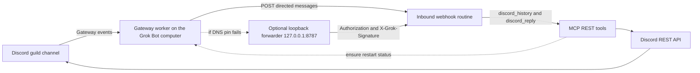

# Grok Bot install playbook

This file is for **Grok Bot** (and any installer agent) that picked up this public repo or plugin. Humans should use `README.md`.

Follow this file **exactly**. Do not improvise a shorter path. Then use the bundled skills: `setup-discord-app`, `connect-grok-bot`, `discord-chat`.

If something is silent or broken, go to **Troubleshooting**. Almost every failure is a skipped step in this file, not a missing feature.

Do not write tokens, webhook keys, `.runtime-webhook.env` values, or connector-secret paths into chat, Discord, or files in this repo.

## Hard rules

1. Do **not** ask the operator to clone the repo. An installer with GitHub access copies the tree onto the Grok Bot computer.
2. Do **not** ask the operator to paste `DISCORD_TOKEN` in chat or Discord. Use a **secret-request**. If it was pasted, tell them to reset the token, then secret-request the new value.
3. Do **not** use Railway. The gateway worker runs on this Grok Bot computer.
4. Never Administrator. Never two Gateways on one token. Never open a Discord Gateway inside MCP. Never start a thread. Never echo secrets.
5. One guild (`DISCORD_GUILD_ID`). Only the parent channels in `DISCORD_CHANNEL_IDS`. DMs stay quiet.
6. MCP is REST only. Never invent a second listener.
7. Do not commit `.runtime-webhook.env`. Do not bake one guild’s IDs or secret paths into shipped files.

## Architecture

There are four moving pieces on the Grok Bot computer, plus Discord. They are **separate processes**. Confusing them is the usual silent-bot failure.

```
Discord channel
    |  Gateway events (Guilds, GuildMessages, MessageContent)
    v
Gateway worker  (one replica per bot token; /status and /new locally)
    |  POST JSON + Authorization + X-Grok-Signature
    |  HTTPS automations URL (default) or loopback forwarder 127.0.0.1:8787
    v
Inbound webhook routine
    |  MCP tools only — REST, never a second Gateway
    v
discord_reply / discord_send / SILENCE
    v
Discord REST API  ->  same parent channel
```



### MCP (REST only)

MCP is the agent’s tool surface. It talks to Discord over REST. It supervises the sidecar. It must never open a Discord Gateway.

| Tool | Role |
| --- | --- |
| `discord_status` | Bot identity, guild, allowlisted channels. Never echoes tokens. `webhookConfigured` is this MCP process only — not the gateway. |
| `discord_send` | Post text in an allowlisted parent channel. `SILENCE` or empty posts nothing. Cannot attach files. Optional `author_id` opens the follow-up window after a real post. |
| `discord_reply` | Reply in the parent channel of an inbound message. Thread pings still reply in the parent. `SILENCE` posts nothing. Cannot attach files. Pass inbound `author_id`. |
| `discord_history` | Recent allowlisted history. Other users are omitted unless they hold an allowed role. |
| `discord_list_channels` | Configured parent channels. |
| `discord_react` | Add a reaction. |
| `discord_worker_status` | Sidecar up/down on this computer. No secrets. |
| `discord_ensure_worker` | Start the sidecar if down; **no-op** if the supervisor is already alive. Never opens a Gateway inside MCP. |
| `discord_restart_worker` | Stop the live supervisor if up, then start one replica with the current env. Use after webhook URL or channel list changes. |

Every tool refuses guilds and channels outside `DISCORD_GUILD_ID` / `DISCORD_CHANNEL_IDS`. Channel, message, and user IDs must be Discord snowflakes.

Register MCP with:

```bash
bash ./bin/launch-mcp.sh
```

Plugin root is the directory that contains `plugin.json` and `bin/launch-mcp.sh` (often `/workspace/grokbot-discord` after a GitHub copy).

### Gateway worker

Long-running Discord.js client on this computer. Intents: Guilds, GuildMessages, MessageContent.

Fail-closed before any webhook or reply:

- author is a bot
- message is a webhook
- no guild (DMs)
- guild is not `DISCORD_GUILD_ID`
- parent channel is not in `DISCORD_CHANNEL_IDS`

If `DISCORD_ALLOWED_ROLE_IDS` is non-empty, members without those roles are dropped even when the line is directed. Empty means anyone in the allowlisted channel may talk. `discord_history` is stricter: other users are omitted unless they hold an allowed role. Empty role list does **not** mean history includes the whole channel.

Directed inbound (see **Who the bot answers**) POSTs JSON to `GROK_WEBHOOK_URL` with `X-Grok-Signature: sha256=...` and `Authorization: Bearer <secret>`.

If `GROK_WEBHOOK_URL` is missing, directed chat is dropped:

```
grok-discord inbound dropped: GROK_WEBHOOK_URL is not set
```

Local room commands do **not** use the webhook. They send from the gateway:

| In-channel command | Worker reply |
| --- | --- |
| `@Bot /status` | `Yeah, I'm here. Gateway up.` |
| `@Bot /new` | `Fresh thread. I'm listening.` |

Both fail if Discord send is 403 / 50013. A silent `/status` is a **permission** problem, not a webhook problem.

Ready log:

```
grok-discord ready as <tag>; one replica per bot token
```

If the webhook URL is unset at boot, the worker also prints that inbound will not wake a Grok Bot. That boot line and the drop line are the source of truth. Do **not** use `discord_status.webhookConfigured`.

Public error line (when a turn throws):

```
Something broke on my side. Not saying more here.
```

Details stay in `~/.grok-discord/worker-*.log` or MCP host logs. Never paste stack traces into Discord.

The worker is allowed to start without `GROK_WEBHOOK_URL`. `/status` and `/new` can still work. Directed chat will not wake a Grok Bot until the URL is on the **gateway** env and the supervisor is restarted.

### Inbound routine

One Grok Bot routine with a **webhook** trigger. It is not a second Discord listener. The gateway is the only listener. The routine is inference: parse JSON, decide whether to talk, call MCP tools.

JSON fields the gateway posts:

| Field | Meaning |
| --- | --- |
| `message_id` | Snowflake to reply to |
| `channel_id` | Channel the event arrived on |
| `guild_id` | Guild snowflake |
| `parent_channel_id` | Parent text channel; replies always go here |
| `author_id` | Author snowflake |
| `author_username` | Author name, already redacted of obvious secrets |
| `content` | Clean content, already redacted of obvious secrets |
| `is_reply` | Whether the Discord message referenced another |
| `referenced_message_id` | Referenced snowflake or null |

Do **not** create extra inbound routines so someone can copy a URL or key from a panel. The agent never usefully sees that panel key. Build the host URL on this computer:

```
https://api2.cursor.sh/automations/webhook/<automationId>
```

`automationId` is the stable UUID from `sha256(agentId NUL routineFolder)`. Pair it with the sender key already on disk (`webhook-keys.json`).

### Optional loopback forwarder

Default: point `GROK_WEBHOOK_URL` at the HTTPS automations URL above. This plugin pins webhook DNS (SSRF guard) and honors Node `lookup` `all:true`.

If the gateway log still shows `Invalid IP address: undefined`, do **not** disable the pin. Point the worker at loopback and forward:

| Variable | Role |
| --- | --- |
| `GROK_WEBHOOK_URL` | `http://127.0.0.1:8787/` — worker POSTs here; DNS pin is skipped |
| `GROK_WEBHOOK_UPSTREAM` | Real api2 automations webhook URL |
| `GROK_WEBHOOK_SECRET` | Same sender key the host already has |

`bin/webhook-forward.mjs` forwards `content-type`, `Authorization`, and `X-Grok-Signature`. `bin/with-env.sh` starts it if `127.0.0.1:8787` is down. After changing these values, `discord_restart_worker`. One replica.

## Install sequence

Do these in order.

### 1. Get the plugin onto this computer

1. Search Plugins for `discord` / `grok-discord`. If **Discord for Grok Bot** is listed, install it.
2. If SearchPlugins returns nothing, the marketplace listing is missing. The GitHub URL **404s** without repo access. That is not evidence the plugin does not exist. Copy the tree onto this Grok Bot computer from an account that can read `NinjaProtocol/grokbot-discord`. Do not ask the operator to clone.
3. If `package-lock.json` cannot be fetched in one GitHub MCP call, regenerate it locally in the plugin root. Do not invent a lockfile by hand.
4. Node **20.19 or newer** is enough (known working host: 20.19.x). An engines warning can still produce `dist/cli.js`. Confirm the build exists, then continue.
5. In the plugin root: `npm install && npm run build`.
6. Register MCP with `bash ./bin/launch-mcp.sh` (`AddMcpServer`). Do not point MCP at a raw `node` MCP entry until the launch wrapper can export token and IDs.

`bin/with-env.sh` loads `.env` and `.runtime-webhook.env` if present, and `DISCORD_TOKEN_FILE` when `DISCORD_TOKEN` is unset. Launch wrappers on one computer are local. Shipped `bin/` templates must read IDs from env, never from a baked guild.

### 2. Create the Discord application

Walk the operator through this (also in `setup-discord-app`):

1. Open [https://discord.com/developers/applications](https://discord.com/developers/applications) and sign in.
2. **New Application**. Name it what people will @mention.
3. **Bot** → **Reset Token**. That value is `DISCORD_TOKEN`. Store it through secret-request, never in chat, never in Discord.
4. Privileged Gateway Intents: **Message Content Intent ON**. Presence off. Server Members off unless they later set `DISCORD_ALLOWED_ROLE_IDS`.
5. Save changes.
6. **OAuth2** → **URL Generator**. Scope: **bot** only. Do not check `applications.commands`.
7. Bot permissions — check these and nothing extra: View Channels, Send Messages, Read Message History, Embed Links, Add Reactions. Attach Files only if uploads are wanted (MCP send/reply cannot attach files).
8. Never Administrator. Never Manage Server, Manage Channels, Manage Messages, or Create Public/Private Threads. This connector never starts threads.
9. Invite the bot to **one** guild.
10. **Mandatory:** in each allowlisted channel, add the **bot’s own role** and grant the same Allows as **channel-level custom overwrites**. A server team role with Send Messages is **not** enough. This is Discord API **50013**. Until those overwrites exist, `discord_send`, `@Bot /status`, `@Bot /new`, inbound replies, and the public error line are all silent. That is not a webhook bug. Never grant Administrator to paper over it.
11. Developer Mode on. Copy Server ID → `DISCORD_GUILD_ID`. Copy each parent text channel ID → `DISCORD_CHANNEL_IDS` (comma-separated). Optional role IDs → `DISCORD_ALLOWED_ROLE_IDS`. Empty role list means anyone in the allowlisted channel may talk to the bot.

### 3. Persist credentials

**Plugins → Configure** may not exist. Persist this way:

| Value | Where it lives |
| --- | --- |
| `DISCORD_TOKEN` | connector-secrets, via **secret-request**. Launch wrapper reads `DISCORD_TOKEN` or `DISCORD_TOKEN_FILE`. |
| `DISCORD_GUILD_ID` | launch wrapper / local `.env`. Not the repo. |
| `DISCORD_CHANNEL_IDS` | same. Parent channel snowflakes only. |
| `BOT_NAME_PREFIX` | optional spoken name. Whole-word match anywhere. |
| `DISCORD_ALLOWED_ROLE_IDS` | optional. Empty = anyone in an allowlisted channel. |
| `GROK_WEBHOOK_URL` and `GROK_WEBHOOK_SECRET` | gateway process env on this computer. Built below. Do not commit `.runtime-webhook.env`. |

Unexpanded `${VAR}` placeholders are ignored. If Configure exists, it may be used for the same values. Never paste the token in chat.

### 4. Create one inbound webhook routine

Create **one** Grok Bot routine with a webhook trigger. Put the prompt in **Inbound routine prompt** on it.

Build the host URL on this computer (pattern above). Put that HTTPS URL in `GROK_WEBHOOK_URL` and the sender key in `GROK_WEBHOOK_SECRET` on the **gateway** env. MCP-only env does not count.

Direct HTTPS is the default. Use the loopback forwarder only if the gateway log shows `Invalid IP address: undefined`.

### 5. Start exactly one worker

1. Confirm `dist/cli.js` exists.
2. Call `discord_ensure_worker` (or `bash ./bin/with-env.sh node dist/cli.js ensure`).
3. Read `~/.grok-discord/worker-*.log`. Expect the ready line: one replica per bot token.
4. If you just changed env (webhook URL, channel list, name prefix): reload MCP if those values live in the launch wrapper, then call **`discord_restart_worker`**. `ensure` is a no-op while the supervisor is alive.

Pidfile `~/.grok-discord/worker-<fingerprint>.pid` is JSON `{ "supervisorPid", "startedAt" }`, not a raw pid. Never start a second gateway on the same token.

CLI:

```bash
bash ./bin/with-env.sh node dist/cli.js ensure
bash ./bin/with-env.sh node dist/cli.js restart
bash ./bin/with-env.sh node dist/cli.js status
```

### 6. Weekday daily alive-check

Do **not** save a 5-minute `discord_ensure_worker` loop. Save one **weekday daily** scheduled routine. Example cron: `27 8 * * 1-5` (08:27 UTC, Monday–Friday). Intent:

```
Once each weekday, keep the Discord gateway worker alive on this Grok Bot computer.

1. Call discord_ensure_worker.
2. If action is already-running, stay silent. Do not message Discord.
3. If action is started, stay silent unless it failed.
4. If it failed, report the error in this conversation only. Never post DISCORD_TOKEN, GROK_WEBHOOK_SECRET, or GROK_WEBHOOK_URL.

Do not start a second Gateway. Do not open a discord.js Client from MCP. Do not use Railway.
```

## Who the bot answers

Three layers. The gateway filter is not always right. The inbound routine must still choose `SILENCE`.

### Fail-closed before directed

Dropped entirely: bots, webhooks, DMs, wrong guild, parent channel not in `DISCORD_CHANNEL_IDS`, or (if roles are set) a member without an allowed role.

### Directed

The gateway wakes the routine when any of these is true:

- @mention of the bot
- reply to the bot
- whole-word bot name **anywhere** after mentions are stripped (`BOT_NAME_PREFIX` plus Discord username / global name)
- follow-up from the same user in the same parent channel within 15 minutes, **after a real non-SILENCE `discord_reply` / `discord_send`**

`/new` and `/reset` clear that window locally.

Whole-word-anywhere also matches third-person talk. The routine must SILENCE those.

| Line | Gateway | Routine |
| --- | --- | --- |
| `<botname> say hello to ghost` | directed (name is the addressee) | Reply |
| `@Bot hello` | directed (mention) | Reply |
| `ghost say hello to <botname>` | directed (whole-word name) | **SILENCE** |
| `ghost health check` | may be a follow-up | **SILENCE** unless it is a real continuation |

Pass inbound `author_id` into `discord_reply` so a real reply opens the follow-up window. `SILENCE` must not open it.

## Inbound routine prompt

Put this on the one inbound webhook routine. Do not add a second inbound routine. Do not add a “copy the webhook URL from the panel” step.

```
You are answering Discord through the grok-discord MCP tools only.
Do not open a Discord Gateway. Do not start a thread. Do not echo
tokens, webhook keys, PEMs, JWTs, API keys, or env files.

The gateway already decided this line looked directed at the bot.
That decision is not always right. You must still choose SILENCE.

Parse the JSON body:
  message_id, channel_id, guild_id, parent_channel_id,
  author_id, author_username, content, is_reply,
  referenced_message_id

1. Call discord_history on parent_channel_id for recent context.
   Reply in the parent channel even if the event came from a thread.
2. Decide whether the author is talking TO the bot, or only
   ABOUT the bot / someone else.
3. If you should answer, call discord_reply with that message_id,
   the inbound channel_id, the inbound author_id, and the answer.
4. If you should not answer, reply with exactly SILENCE
   (or skip the tool). Empty text also posts nothing.

SILENCE in these cases:
- Third-person talk that only mentions the bot's name
  (example shape: "ghost say hello to chief").
- Follow-up noise that is not for the bot
  (example shape: "ghost health check").
- Ambient chat that happened to contain the bot name as a word.
- Anything that is not a real request to this bot.
- You have nothing useful to say.

Answer when:
- The author @mentions the bot and is asking it to do something.
- The author addresses the bot by name as the intended recipient
  (example shape: "chief say hello to ghost").
- This is a real continuation of a conversation you already joined.

Never start a thread.
Never post stack traces. The public error line is already:
  Something broke on my side. Not saying more here.
```

## Verify in this order

Do not skip ahead to `@Bot hello`. That hides whether the failure is REST, send, webhook, or name matching.

1. **REST status.** `discord_status` shows the bot identity, the one guild, and the allowlisted channels. It must not show a token.
2. **Send.** `discord_send` a short harmless line to an allowlisted channel. If this is 50013, stop and fix channel-level bot-role overwrites. Do not debug webhooks yet.
3. **Worker ready without a missing-URL warning.** `discord_worker_status` shows running. The worker log shows `grok-discord ready`. After webhook env is attached, that log must not still say inbound will be dropped because `GROK_WEBHOOK_URL` is not set.
4. **One replica.** One supervisor pidfile, one live `supervisorPid`, one gateway.
5. **`@Bot /status`.** Replies `Yeah, I'm here. Gateway up.` If silent, send is still 403. This does not prove inbound.
6. **Gateway env has the webhook URL.** Read the gateway process env or log, not `discord_status.webhookConfigured`.
7. **Forwarder listening if used.** If `GROK_WEBHOOK_URL` is loopback, `127.0.0.1:8787` must be listening.
8. **Inbound `lastRunAt` after `@Bot hello`.** A reply or a SILENCE both count as a run. No run means the POST never arrived.
9. **Name vs third-person.** Whole-word address gets a reply. Third-person name hits SILENCE.
10. **Other channels silent.** A mention in a channel not in `DISCORD_CHANNEL_IDS` produces no reply and no inbound run. DMs stay quiet.

Proof pair to ask the operator for: a line that addresses the bot by name should get a reply; a line that only talks about the bot by name should stay silent.

## Troubleshooting

Use this table when the install is not clean. These are the failures that happen when a step above was skipped or substituted.

| Symptom | Likely cause | What to do |
| --- | --- |
| SearchPlugins for `discord` / `grok-discord` is empty | Plugin is not in the marketplace | Copy the repo from an account that can read `NinjaProtocol/grokbot-discord`. Do not ask the operator to clone. Do not use Railway. |
| GitHub repo URL 404s | Repo is private or the current GitHub account cannot read it | Use an account with access. The 404 is not evidence the plugin does not exist. |
| No Plugins → Configure card | Marketplace card does not exist | secret-request for the token; guild/channel IDs in the launch wrapper. |
| Operator is asked to paste the token in chat | Agent drift | **Stop.** Token goes through secret-request only. Reset the token if it was pasted. |
| Install prints an engine warning | Host Node is 20.19.x | Known. Confirm `dist/cli.js` exists, then continue. |
| GitHub MCP cannot download `package-lock.json` | Lockfile too large for one call | Regenerate locally. |
| MCP tools missing / server will not start | Plugin not built, or MCP command is not the launch wrapper | Plugin root with `plugin.json`. Use `bash ./bin/launch-mcp.sh`. |
| Worker log: inbound dropped, `GROK_WEBHOOK_URL` is not set | Gateway process has no webhook URL | Set URL and secret on the **gateway** env. `/status` and `/new` can still work. Then `discord_restart_worker`. |
| `discord_status.webhookConfigured` is false, but inbound works or the log shows a URL | MCP and gateway are different processes | Trust gateway env/log, not the MCP flag. |
| `discord_ensure_worker` / `ensure` reports already-running after an env change | Ensure is a no-op if the supervisor is alive | `discord_restart_worker`. Never two Gateways. |
| Pidfile looks like a single number and kill does nothing useful | File is JSON `{supervisorPid, startedAt}`, not a raw pid | Parse JSON. Kill `supervisorPid`, or use `discord_restart_worker`. |
| Discord API 50013 on `rest.send` | Server team role is not enough | Channel-level custom overwrites on the **bot’s own role**. Then send again. Never Administrator. |
| `@Bot /status` or `@Bot /new` is silent | `speak()` cannot send (same 50013 class) | Fix channel overwrites. These commands do not use the webhook. |
| Channel shows the public error line after a mention | Worker accepted the line, then the turn threw | Read the gateway log. Do not paste the stack into Discord. |
| Gateway log: `Invalid IP address: undefined` | Direct api2 POST plus DNS pin on a host that still mishandles `lookup` `all:true` | Loopback URL + `webhook-forward.mjs` + `GROK_WEBHOOK_UPSTREAM`, then `discord_restart_worker`. Do not disable the SSRF pin. |
| Forwarder not listening, inbound `lastRunAt` stuck | `with-env.sh` did not start it, or port 8787 is down | Start `bin/webhook-forward.mjs`. Confirm `127.0.0.1:8787`. |
| Inbound `lastRunAt` does not move after `@Bot hello` | POST never reached the routine | Missing URL, Invalid IP, dead forwarder, or worker not restarted after env change. One replica. |
| Name-as-addressee replies, third-person name also replies | Routine is not SILENCEing third-person name hits | Use the inbound prompt in this file. Whole-word matching is working; the routine must still SILENCE. |
| After a SILENCE, later ambient lines wake the bot | Follow-up window opened, or `author_id` was omitted on a real reply | Pass `author_id` only on real replies. SILENCE follow-up noise. Window is 15 minutes. `/new` clears it. |
| Bot talks in the wrong channel | Channel not restricted | Fail-closed on parent channel. Check `DISCORD_CHANNEL_IDS`. |
| Bot talks in DMs | Should be impossible | DMs have no `guildId`. Stop and inspect; do not add DM intents. |
| `discord_history` looks empty of other people | Other users omitted unless they hold an allowed role | Empty `DISCORD_ALLOWED_ROLE_IDS` allows anyone to talk, not to appear as peers in history. |
| Need to post a screenshot; `discord_send` has no file field | MCP send/reply cannot attach | Raw multipart POST to the channel messages endpoint. Invite needs Attach Files. |
| Two ready lines / Discord reconnect storms | Two gateway processes on one token | Kill extras. One supervisor, one gateway. MCP must never open a Gateway. |
| Agent opens a Gateway inside MCP | Agent drift | **Stop.** MCP is REST only. Tools listed above. |
| Watchdog firing every 5 minutes | Wrong default | Replace with one weekday daily alive-check (`27 8 * * 1-5`). |
